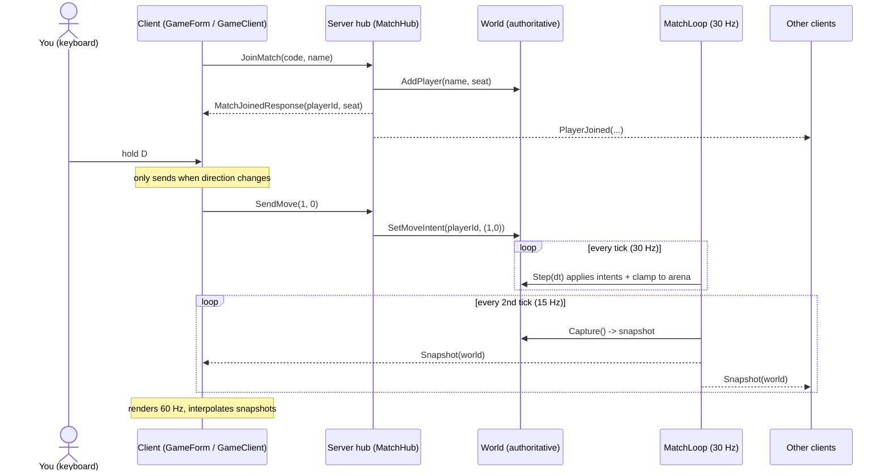

# How it works — client/server communication

This document explains, in detail, how the Unhallowed prototype talks over the network. It is
written to be read out and defended: every claim points at the class or method that backs it.

## The one-sentence version

The server is **authoritative**: clients open a persistent **SignalR WebSocket**, send small
**JSON intents** ("I want to move this way"), and the server — the only place the game is actually
simulated — sends back **snapshots** of the whole world that the clients simply draw.

The important consequence, and the thing to stress in a defence: **a client never changes the
game state, not even its own player.** It asks; the server decides; the client renders the answer.

## The building blocks

| Concept | What it is here | Where |
| --- | --- | --- |
| **Transport** | One long-lived WebSocket per client (SignalR's default transport) | `HubConnectionBuilder().WithUrl(...)` in `GameClient` |
| **Payloads** | JSON. Property names kept as-is (PascalCase) | `AddSignalR().AddJsonProtocol(...)` in `Program.cs` |
| **The contract** | The fixed set of messages each side may send | `Protocol.cs` + the DTOs in `Contracts/Messages` |
| **The hub** | The server's single network entry point | `MatchHub` |
| **The simulation** | The authoritative game world, one per lobby | `World`, driven by `MatchLoop` |

Nothing is peer-to-peer. Every message goes client ↔ server. Clients never talk to each other
directly; when you see another player move, you are seeing the server's snapshot, not their client.

## The contract: exactly which messages exist

Both directions are asynchronous and full-duplex (either side can send at any moment), but the set
of messages is **fixed and named**. This is the whole vocabulary:

### Client → Server (the client invokes methods *on the hub*)

Defined as public methods on `MatchHub`:

| Method | Argument | Returns | Meaning |
| --- | --- | --- | --- |
| `JoinMatch` | `JoinMatchRequest(matchCode, displayName)` | `MatchJoinedResponse(matchCode, playerId, seat)` | "Give me a seat in this lobby." |
| `SendMove` | `MoveIntent(x, y)` | — | "I want to walk in this direction." Values are −1..1. |
| `LeaveMatch` | — | — | "I'm leaving." |

### Server → Client (the server pushes; the client registered handlers with `connection.On<T>(...)`)

Names are constants in `Protocol.ServerToClient`:

| Message | Payload | Meaning |
| --- | --- | --- |
| `Snapshot` | `WorldSnapshotDto(tick, players[])` | The full world state this tick. Sent 15×/sec. |
| `PlayerJoined` | `PlayerPresenceDto(playerId, displayName, seat)` | Someone joined this lobby. |
| `PlayerLeft` | `PlayerPresenceDto(...)` | Someone left. |

A `WorldSnapshotDto` is deliberately tiny and flat — a tick number plus a list of
`PlayerSnapshotDto(id, displayName, seat, x, y)`. Small on purpose, because it is sent 15 times a
second to every player.

## The connection lifecycle

1. **Open.** The client builds a `HubConnection` to `http://<host>:5080/hub/match` and calls
   `StartAsync()`. SignalR negotiates and opens a WebSocket. (`GameClient.ConnectAsync`)
2. **Join.** The client calls `JoinMatch(...)`. On the server, `MatchHub.JoinMatch` finds or
   creates the `Match` for that lobby code, calls `Match.Join`, which assigns the next free seat
   (0–3) and calls `World.AddPlayer(...)` to create the authoritative `Player`. The hub returns the
   new player's id and seat, and pushes `PlayerJoined` to everyone else in the lobby.
3. **Play.** Two independent streams run at once (see below).
4. **Leave.** When the socket drops, SignalR calls `MatchHub.OnDisconnectedAsync`, which calls
   `Match.Leave` → `World.RemovePlayer`. The player is gone from the next snapshot; `PlayerLeft` is
   pushed to the lobby.

## The two streams that make up "playing"

These two loops are **decoupled** — they run at different rates and neither waits for the other.

### Stream 1 — input going up (client → server)

- A WinForms timer in `GameForm` fires ~30×/sec. It reads the held keys (WASD / arrows) and forms a
  direction vector.
- It sends `SendMove` **only when that direction actually changes** (`GameForm.SendInputAsync`
  compares against `_lastMove`). Standing still, or holding one direction, sends nothing — the
  server keeps applying your last intent. This keeps traffic tiny.
- On the server, `MatchHub.SendMove` does **not** move anyone. It just records the intent:
  `World.SetMoveIntent(playerId, ...)`. That is all the hub ever does — validate and store.

### Stream 2 — state coming down (server → client)

- `MatchLoop` is a background service that runs a **fixed-step loop at 30 Hz** (`Protocol.TickRate`).
  Each tick it calls `World.Step(dt)`, which walks every player in the direction of their stored
  intent and clamps them inside the arena.
- Every **second** tick (so 15×/sec, `Protocol.SnapshotRate`) it captures the world into a
  `WorldSnapshotDto` and broadcasts it to the whole lobby with
  `hub.Clients.Group(code).SendAsync("Snapshot", dto)`.
- Each client receives snapshots into a `SnapshotBuffer` and draws them ~60×/sec.

So: **input is event-driven and rate-capped; state is a steady 15 Hz broadcast; rendering is 60 Hz.**
Three different clocks, on purpose.

## Worked example: you press **D** (move right)

1. `t = 0 ms` — You hold **D**. Within ~33 ms the client's input timer notices the direction changed
   to `(1, 0)` and sends `SendMove(1, 0)` over the socket.
2. The hub receives it and calls `World.SetMoveIntent(yourId, (1,0))`. **Your dot has not moved yet.**
3. On the next 30 Hz tick, `World.Step` moves your authoritative `Player` right by
   `MoveSpeed (200) × dt`.
4. On the next snapshot (≤ ~66 ms later) the server broadcasts a `WorldSnapshotDto` in which your
   `x` is now larger. Every client in the lobby — including yours — receives it.
5. Your client's renderer draws you at the new position. **Only now do you see yourself move.**

That round-trip is why the design is honest about latency (below), and why it is cheat-resistant: a
hacked client can *ask* to teleport, but it can only send a `MoveIntent`; the server still only
advances players by `MoveSpeed`.

## Why authoritative? (the point of the whole design)

- **Consistency.** There is exactly one `World`. All four players are shown the same truth, because
  they are all rendering the same server snapshots. No two clients can disagree.
- **Cheat resistance.** Clients send intents, not positions. The server owns movement, collision and
  (later) combat, so a modified client cannot move faster or walk through walls.
- **Simplicity of the client.** The client is "dumb": sample input, draw snapshots. All the game
  rules live in one place (`Unhallowed.Core`), which is also what lets the server run headless.

## Two details worth understanding before a defence

### Interpolation (why remote players look smooth)

The server only sends 15 snapshots a second, but the client draws 60 frames a second. If it drew
the newest snapshot each frame, players would jump in 15 discrete steps. Instead `SnapshotBuffer`
renders the world ~100 ms *in the past* and **interpolates** between the two snapshots that bracket
"now", so movement looks continuous. See `SnapshotBuffer.GetInterpolated`.

### No client-side prediction (an honest trade-off)

This prototype has **no client-side prediction**: even your own player waits for the server snapshot
before it moves on screen. That is simpler to build and explain, and perfectly consistent, but it
means your own input feels slightly delayed (network round-trip + the 100 ms interpolation buffer).
Real fast-paced games add *prediction* — the client immediately moves your own dot and later
reconciles with the server. That is a deliberate future improvement, not an accident. Being able to
say this is a strong point in a defence.

## The message flow, as a sequence diagram

## Glossary (terms a tutor may ask you to define)

- **Authoritative server** — the server holds the only real game state; clients cannot change it.
- **Intent** — a request describing what a player wants to do (`MoveIntent`), not the result.
- **Tick** — one fixed step of the simulation (here 1/30 s).
- **Snapshot** — an immutable copy of the world at one tick, serialized to JSON and broadcast.
- **Interpolation** — drawing smoothly between two snapshots so 15 Hz updates look like 60 Hz motion.
- **Full-duplex** — both sides of the socket can send at the same time, independently.

## File map

| Responsibility | File |
| --- | --- |
| Wire constants (rates, hub path, message names) | `src/Unhallowed.Contracts/Protocol.cs` |
| Message shapes (DTOs) | `src/Unhallowed.Contracts/Messages/*.cs` |
| Server network entry point | `src/Unhallowed.Server/Hubs/MatchHub.cs` |
| Authoritative loop + broadcast | `src/Unhallowed.Server/Matches/MatchLoop.cs` |
| The simulation | `src/Unhallowed.Core/Simulation/World.cs` |
| Client-side network wrapper | `src/Unhallowed.Client/Net/GameClient.cs` |
| Snapshot buffering + interpolation | `src/Unhallowed.Client/Net/SnapshotBuffer.cs` |
| Input sampling + rendering | `src/Unhallowed.Client/GameForm.cs` |
